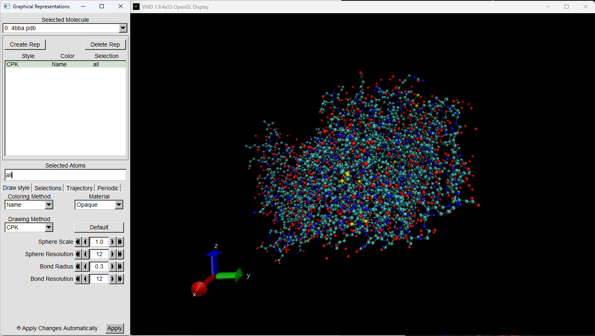

# Биоинформатика HW4

## Исследуемый белок:

4BBA

[RCSB PDB - 4BBA: Crystal structure of glucokinase regulatory protein complexed to phosphate](https://www.rcsb.org/structure/4BBA)

Spacefill (В программе CPK):

VDW:

Ribbons:

Schematics(Cartoon):

Molecular Surface(QuickSurf):

Surf:

Surf(representation: wireframe)

Bonds:

Wireframe:

## Ссылка на видео

[https://youtu.be/-AG2yRCHrAg](https://youtu.be/-AG2yRCHrAg)

HighResolution pictures:

