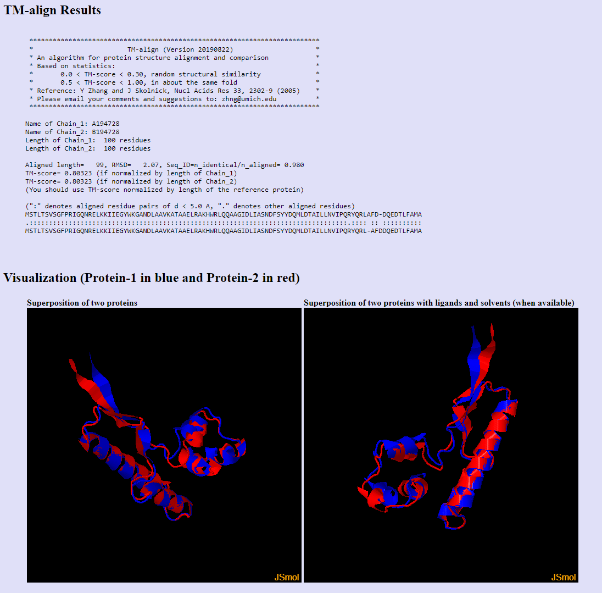

# HW5

Последовательность: MSTLTSVSGFPRIGQNRELKKIIEGYWKGANDLAAVKATAAELRAKHWRLQQAAGIDLIASNDFSYYDQMLDTAILLNVIPQRYQRLAFDDQEDTLFAMA

Программы предсказатели: 

- ESMFold

[Google Colaboratory](https://colab.research.google.com/drive/14ntmXMarkTDZAk_rhY6U9E8_aobGascU?usp=sharing)

- AlphaFold2

[Google Colaboratory](https://colab.research.google.com/drive/1RnqsilDFB3qc7HpWH8uQG8_bt15OEvtu?usp=sharing)

Выравниватель:

- TMAlign

Ссылка на визуализацию: 

[TM-align Server](https://seq2fun.dcmb.med.umich.edu//TM-align/tmp/194728.html)

Снимки экрана:

На скриншотах видно, что предсказания оказались схожими.